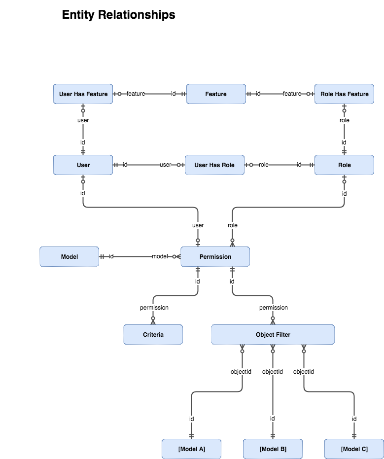

### Overview

A `User` is allowed to perform a CRUD action on a `Model` when they have been granted
at least one `Permission` which grants sufficient access required to fulfill the request.

- User belongs to a `Role` which has the requested `Permission`.
- User has been been added directly to a `Permission`.

### Reference Diagram

This diagram shows the relationships between all of the permissions related entities.

### Model

A `Model` is one of your defined Waterline collections; in sails.js, these are the modules inside `api/models`.

> All `Model` entries are automagically managed by fixtures on Sails lift.

### User

A `User` is a user managed by the [@inspire-platform/sails-hook-auth](https://github.com/conceptainc/sails-hook-auth) module.

> This auth module is a direct dependency of the permissions module, so there is no need to install it.

### Role

A `Role` links a `User` to one or more `Permission`. Many users can share the same Role.

A `Permission` can only be granted to a single `Role`.
If two `Role` want to permit the same action, two `Permission` objects must be created.

> By default, all new Users are given the [configured](Configuration.md) `defaultRole`.

### Permission

A permission grants one CRUD action for `Model` directly to a `User`, or indirectly to a `User` via a `Role`.

Actions:
- create (POST)
- read (GET)
- update (PATCH,PUT)
- delete (DELETE)

Relations:
- role: Permission applies if assigned via `Role`.
- user: Permission applies if assigned directly to `User`.
- owner: Permission applies if optional `owner` attribute on model matches authenticated user id.
  It is not possible to use this with the `create` action.

Advanced Filtering:
- [Criteria](#criteria)
- [Object Filters](#object-filter)

> __Important:__
> - Permissions are aggregated, not merged.
> - Permissions are applied using short-circuit logic upon first successful grant.
> - More lenient access always supersedes stricter access.
> - If one `Permission` has both Criteria and Object Filters, they are applied using `OR` logic.
    This means a `Criteria` may inadvertently circumvent the `Object Filters` white list if the `where`
    criteria matches object which are NOT in the white list.

### Criteria

A `Criteria` allows fine-grained control of a `Permission`.
A permission can have zero-to-many `Criteria`.
Each `Criteria` can have a `blacklist` and/or a `where` clause.

- `where`: Valid Waterline criteria which limits the scope of the `Permission`.
- `blacklist`: Disallows action on the specified model attributes.

### Object Filter

An `Object Filter` is essentially a white list of specific objects that the permission grants access to.
A `Permission` can have zero-to-many `Object Filters`.

Each `Object Filter` is simply a reference to the id of an object stored in the `Model` protected by the associated `Permission`.

> __Important:__
>
> Currently, no foreign key checks are performed on the object ids when inserted.